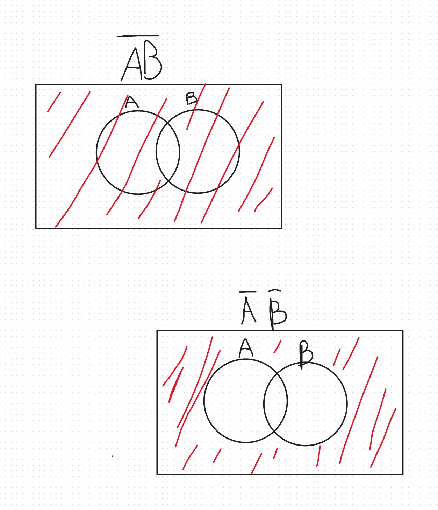

What is the difference between model validation and calibration?  
Validation is the proof of it being true while calibration is the calculation to see what would happen or be true.  

what are aesthetics in data visualization? Name a few aesthetics that can appear in a data visualization.  
  All data visualizations map data values into quantifiable features of the resulting graphic.
Position, Shape, Size, Color, Line Width, Line Type  

Best visualization coloring.  
  The purple/pink to green is better as we could have a color blind audience which would switch up the red and green.  

Visualization color scales.  
What is each color-scale good for in Data Science?  
 A) Qualitative   
 B) Data Values    
 C) Diverging  
 D) Highlight  
 
Name the three pillars of science.  
  predictive computing numerical simulation data-driven discovery via machine learning, deep learning  
  
Is logical implication the same as physical causation? Explain with a real-world example.  
  No, if everything were to be proven we would be able to accurately predict the weather but reality is not the same as logical implications. What we gather and reality are two separate categories.  

  Suppose we have fit the following red-line to the following blue dataset representing the global temperature increase of Earth over the past centuries.  
global land temperature of Earth  
Is this visually a good fit in your opinion? Why?  
  1. It is okay I would show both quadratic, exponential, and linear for more data.  
  2. Accuracy of weather as there was not recordings or recordings of data could be off.  
  3. Positive.  
  4. Yes as it shows what happens over a period of time.  
  5.  0.05  
  
  
Which school(s) of probability theory allow incorporation of expert (prior) knowledge in scientific inference?  
  Classical Probability, Bayesian Probability   
  
When data is scarce, which school of probability theory is the most useful for scientific inference?  
  Classical Probability, Bayesian Probability  
  
Which school of thought in Probability Theory cannot define or discuss the probability of existence of God? Why?  
  Frequentist as there is no way to calculate how many times God appears to show he is real. Cant say how frequent God acts.
    
A wrong visualization.  
  It shows both females and males together and it goes below 0.
  
Why is everything represented by integers in computers?  
  Computer reads in binary which is true or false not in between.  
  
Name an ancestor programming language of C.   
B  
  
Name the first high-level programming language in computer history.  
  FORTRAN  '
  
Recall the Boolean algebra’s fundamental identities from our lecture notes. Show that,
  
C(A+B)¯¯¯¯¯¯¯¯¯¯¯¯¯¯¯¯¯¯¯¯¯≡C¯¯¯¯+A¯¯¯¯ B¯¯¯¯  
Show via a Venn Diagram or a Truth Table, or explain by a logical argument that (A⇒B) ≡ (B¯¯¯¯⇒A¯¯¯¯)  
. Hint. This is a very simple question. Recall what logical implication means in terms of a Venn diagram. How does A  
 look relative to B  
? Does the same also hold for B¯¯ ¯¯  
 relative to A¯¯¯¯  
?

Name the two different categories of logical reasoning and provide and example of each class.  
 Experiment and Theory Theory is easier to explain which is if we do the math like how in Oppenheimer they did the math for a nuclear bomb to see if the reaction would work and it did not but when done in an experiment it did work. "Theory can only take you so far"  

  
What does it mean if two Boolean propositions are equal?  
They are exactly the same.  

  
Show, via Venn diagrams, that AB¯¯¯¯¯¯¯¯≢A¯¯¯¯ B¯¯¯¯  

Can we represent all real numbers in computers?  
Consider the following summation:  
S=3+6+9+…+93+96+99 .  

What is the value of S? Explain your novel strategy to get your answer.
(Hint: There are 33
 numbers in the summation.)  

