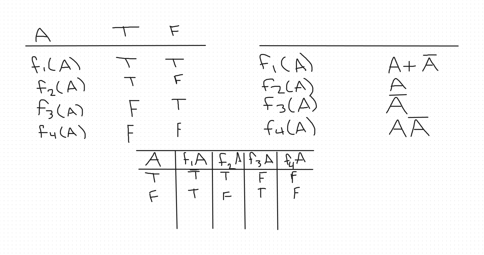
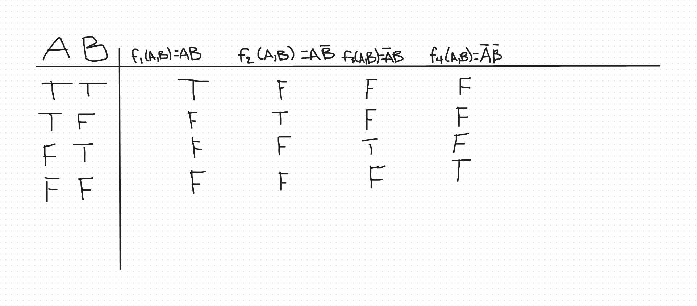
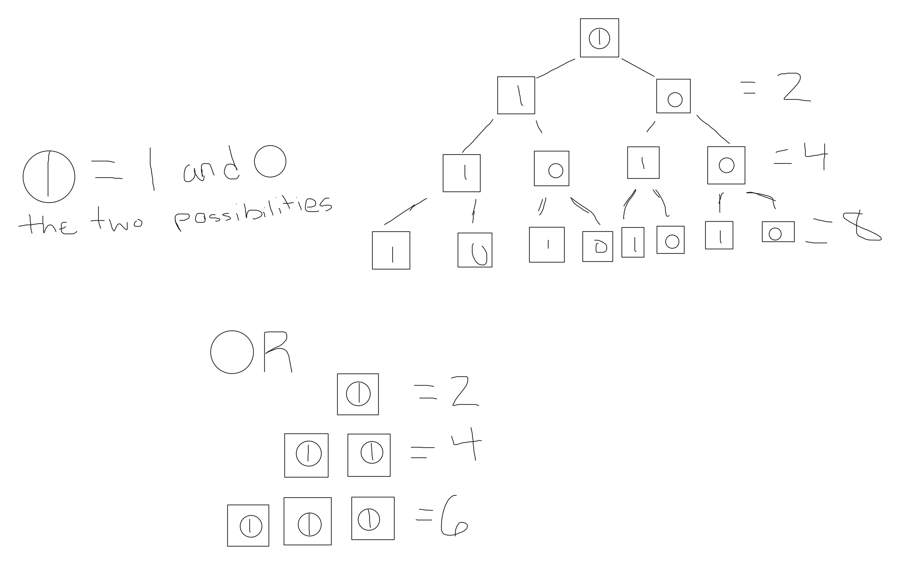

Name the three pillars of Science.  
Experiemnt/Observaations  
Theory/ physical models  
Computational/ Data-driven models  

Name and briefly describe three different applications of Computational and Data Sciences.  
Experiemnt/Observaations  
Theory/ physical models  
Computational/ Data-driven models  

Name the two types of scientific reasoning.  
Deductive and plausible  
Provide an example that shows logical implication does not necessarily imply physical causation.  
We can say it's cloudy because it's raining. The clouds themselves are what caused the rain. It raining therefore it is cloudy  
Policeman, jewelry, and burglar.  
If A and B then C  
  
Logical Implication.  

Logical product denial.  
.jpg).

Logic functions with 1 input.   

.    
 

Logic functions with 2 input  
.   

Logic functions in terms of logic functions.    

The fundamental logical operators.  

Consider the following series of questions:  
a. What is the tiniest unit of information?  bit  
Hint: This unit also represents the tiniest bit of information in computers.  
b. Why does this amount of information represent the tiniest information unit? Yes or NO  / On or Off   
Hint: Use inductive logic with examples to explain your reasoning.  
Imagine yourself as a single dot in empty space in a universe devoid of anything else.  
Would you be able to tell your coordinates in the universe?  Not at all  
or whether you are moving? or at what constant speed?  Not at all  
Why? What extra piece of information do you need to answer the above questions?  We know travel and distance because we can one of three things. Feel it, see it, or measure it- without any of that, it is impossible.
c. Let’s assign a box to this tiniest representable amount of information.  
Obviously, we cannot represent much information with it. So, our remedy is to put multiple of these boxes to represent information about something.  
1. How many different things can we assign to (or represent with) a collection of 1 such boxes?  2  
2. How many different things can we assign to (or represent with) a collection of 2 such boxes?  4  
3. How many different things can we assign to (or represent with) a collection of 3 such boxes?  8  
Hint: Draw binary trees as we described in class to justify your answers.

.  

