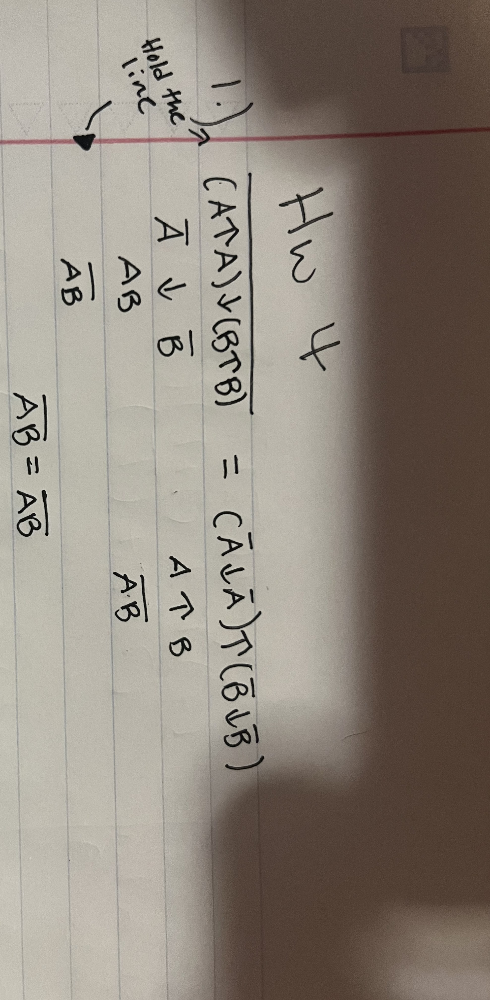
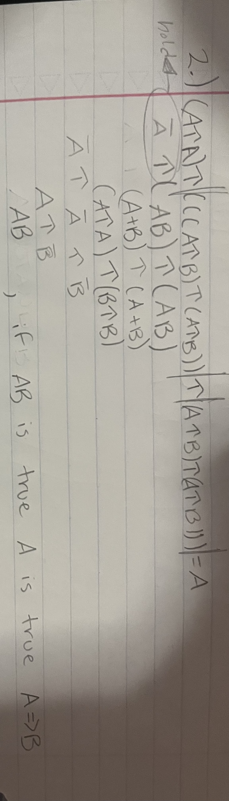
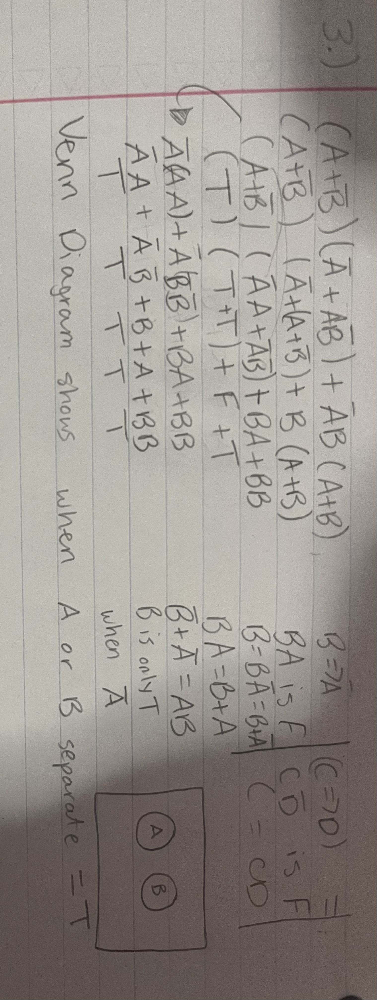
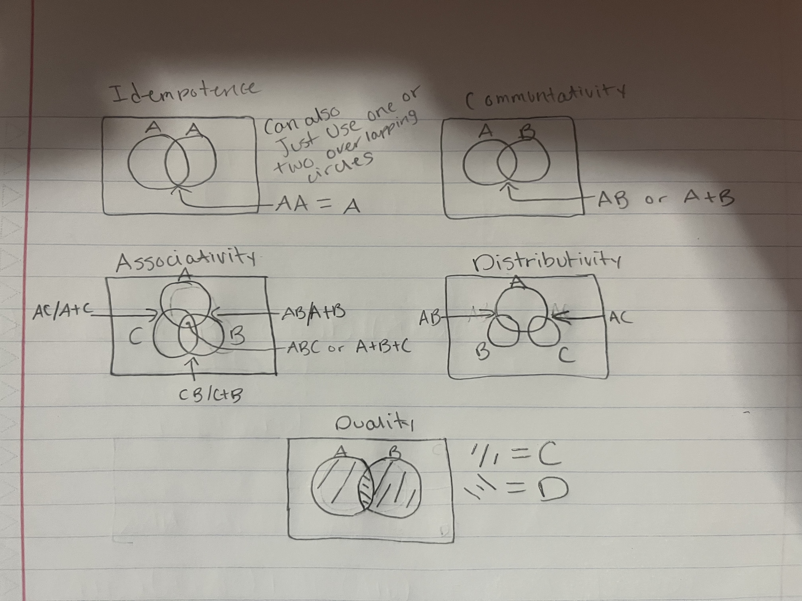
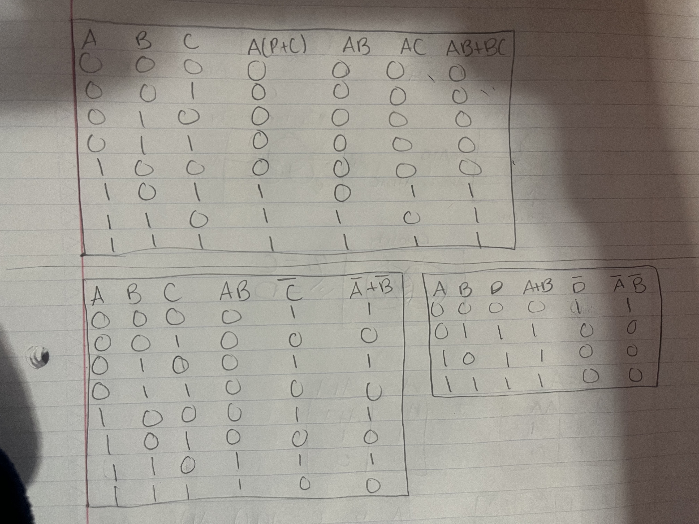
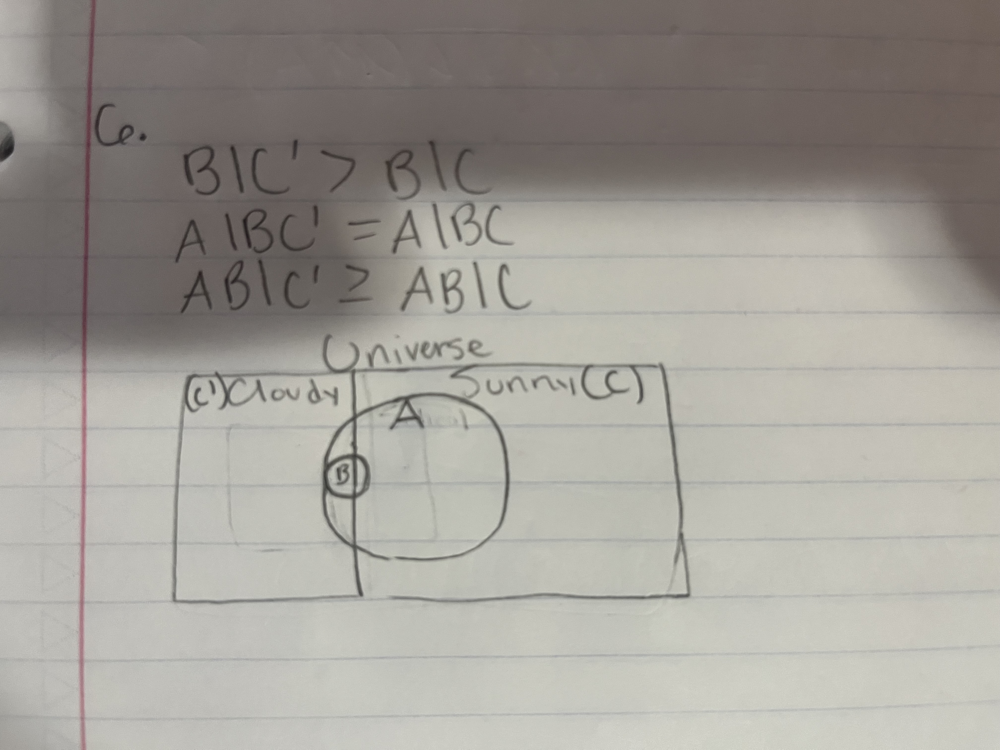

1. Logic NAND and NOR.  
 .   

2. Logic NAND equivalence.  
 .  

4. Logic implication, denial, equivalence.  
 .  

6. Respond to this question only for the cases of Distributivity and Duality identities.  
 .  

8. Respond to this question only for the cases of Distributivity and Duality identities.  
 .  

10. Probability Theory: correspondence with commonsense.  
 .  

12. The fundamental desiderata of Probability Theory.  
Reality, Scenario, Data  

