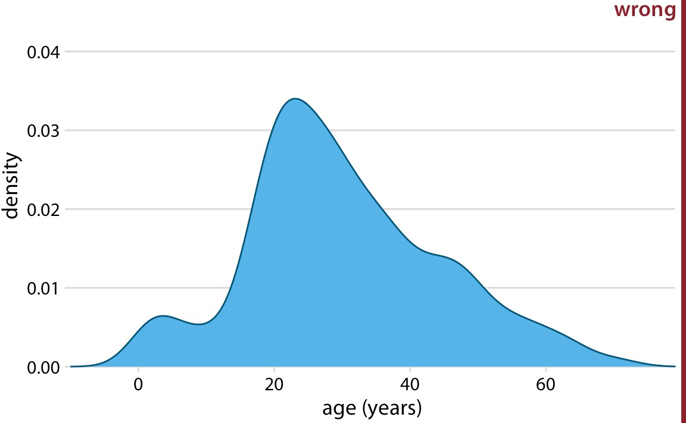

1) What are aesthetics in data visualization? Name a few aesthetics that can appear in a data visualization.  
  All data visualizations map data values into quantifiable features of the resulting graphic.  
  Position, Shape, Size, Color, Line Width, Line Type  
  
2) Name the two major classes of aesthetics.  
  Those that can represent continuous data and those that can not.  
    
3) Name the two major types of data and provide an example for each category.  
  Continuous- quantitative/numerical continuous. Arbitrary Numerical Values  
  Discrete- quantitative/categorical ordered. Good, Fair, Poor  
  
4) What is the common name for variables holding qualitative data?  
Factors and the different categories are called levels.  
  
5) Provide examples of ordered and unordered data.  
  Ordered- Quantitative, Numerical, size, color, width, area  
  Unordered- Qualitative, Categorical, shape, color, style,  
  Both- size, color, width, area, Qualitative, Categorical  
  
6) What are the types of data in the columns of the following table?  
  Quantitative/Qualitative? Quantitive  
  Numerical/Categorical? Numerical  
  Continuous/Discrete? Discrete  
  Ordered/Unordered? Ordered   
.  

7) What kinds of axes in a plot should be represented with the same units and grid size?  
  Coordinate System - when data needs to be compared or on an even scale to represent relativity. It is a good practice.  
  
8) Describe an example scenario in which transforming the axes of the plot results in better visualizations.  
  Especially good when having Skewed DATA or non-linear as the outliers can alter the data in a misleading way and that needs to be recognized.  
  
9) Which one of the following three coordinates are valid and can be used to represent data?  
  All can be used to represent data dependent on the audience and its knowledge and the data. Usually, we only want to use the black grid as it is the most basic for all views and you can show all types of relevance whether that is with dots, linear, not linear,           exponential, etc…  
   
  
10) What kind of data set can be best visualized in polar coordinates?  
  Data of a periodic nature. Time, Rotation, Any Calculation with Pi, Navigation/Radar, Waves, Complex Numbers  
  
11) Name four different color scales and explain their most appropriate usage.  
  Quantitive Color Scale-  To distinguish discrete items or group that do not have an intrinsic order   
  Color to represent data values- income, temperature, or speed (sequence of color)  
  Diverging Color Scale-  visualize the deviation of data values in one of two directions relative to a neutral midpoint  
  Color as a tool to Highlight- There may be specific categories or values in the dataset that carry key information about the story we want to tell, and we can strengthen the story by emphasizing the relevant figure elements to the reader.  
  
12) What is wrong with the following visualization?  
  From the PowerPoint, we know this is the distribution of height but the problem is this does not include the separation of ethnicity but more importantly the gender separation.
.  
  
13) Best visualization coloring.  
  The purple/pink to green is better as we could have a color blind audience which would switch up the red and green.  
  
14) Visualizing and comparing the temperatures of Honolulu and Duluth via Excel.  
  Duluth- Average 40.41 F, STDEV ~ 21.38  
  .  
  Honolulu- Average 77.37 F, STDEV ~ 3.49  
  .  
  Which one is hotter?  
  Which city has less fluctuating temperatures across days of the year?  
  How do the temperatures of these two cities correlate with each other?  
.

15)  
     .

16) 

17) Name four major schools of Probability Theory.  
  Classical Probability, Bayesian Probability, Frequentist Probability, Propensity  

18)  
     
It will be about 0.8 in 2050.  
     
It will be about 1.75.  
  In this case scenario, I would say the quadratic but personally, I am finding the number between both and saying that will be the temperature in 2050.

19) How many and what living creatures can you identify in this picture?   
      
  2, A frog and a horse  
  
20)Move just one matchstick in the following equation to make it hold.  
   You can take from the 8 turning it into a 6 and puting that match stick at the top of the 4 to get "6+3-9=0" which is correct.  
    

 

