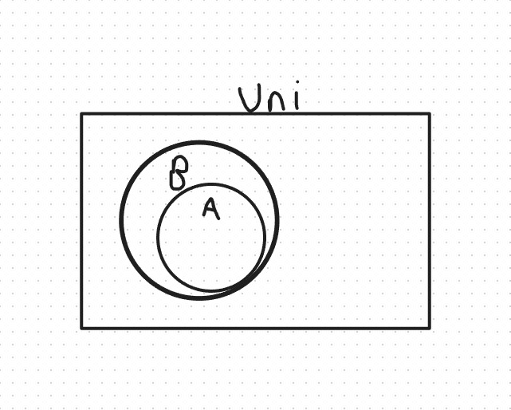
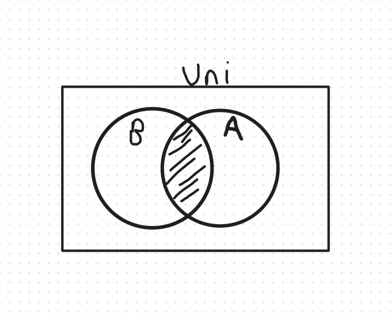
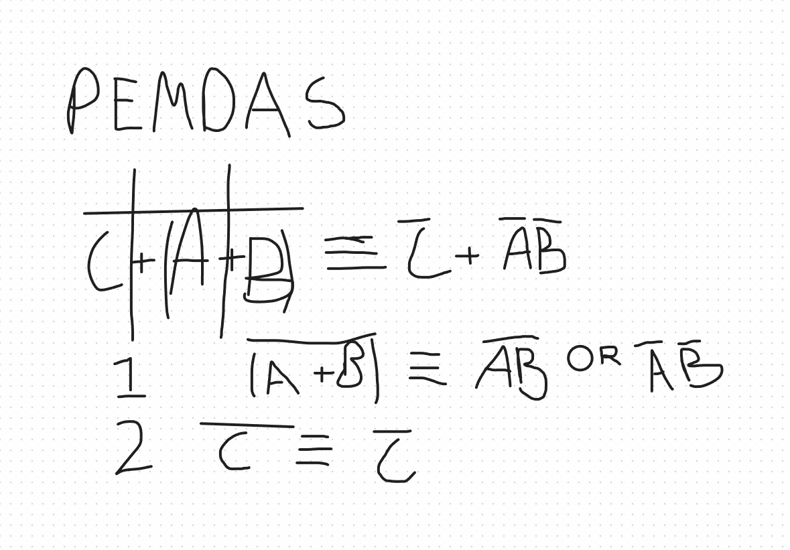
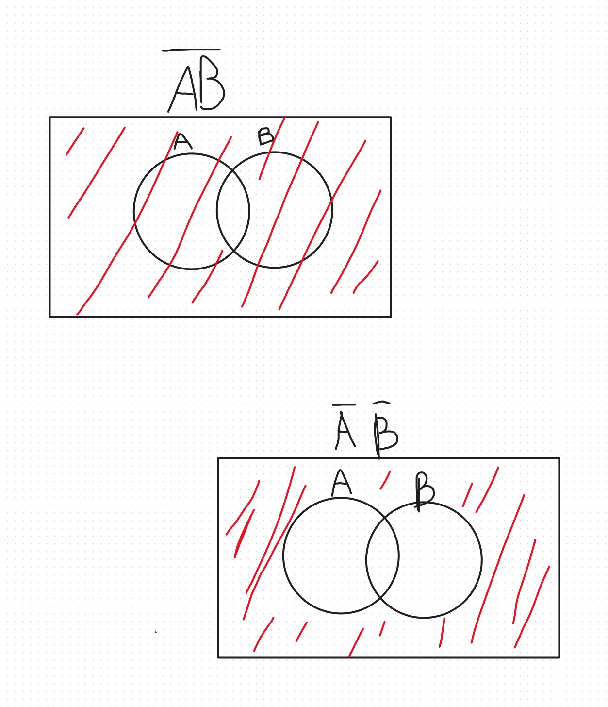

1)Name and describe briefly the steps involved in scientific inference.
Experiment/Observations- we make an experiment or observations to figure out our data
Theory/ physical models- we then make a model to show the data and patterns
Computational/ Data-driven models- we then can infer future data and or solutions with computational power.

2)Name the three pillars of science.
predictive computing
numerical simulation
data-driven discovery via machine learning, deep learning

3)Describe three different major applications of the third pillar of science with respect to the first two.
(Hint: Recall the discussions we had early in the semester during the first lecture series. Where and how could the third pillar replace the other pillars?)

4)Name the two different categories of logical reasoning and provide and example of each class.
Experiment and Theory
Theory is easier to explain which is if we do the math like how in Oppenheimer they did the math for a nuclear bomb to see if the reaction would work and it did not but when done in an experiment it did work. "Theory can only take you so far"

5)Is logical implication the same as physical causation? Explain with an example.
They are not. If A then B is not correct as we can have A without B. It will rain because it is cloudy is incorrect because cloudy does not always lead to rain implying that A does not always lead to B. OR if raining then cloudy. It can be cloudy and not rain.

6)Who is the Boolean algebra named after?
George Boole (1854)

7)Illustrate the logical conjunction via a Venn Diagram.
.

8)Illustrate the logical disjunction via a Venn Diagram.
.

9)What does it mean if two Boolean propositions are equal?
They are exactly the same.

10)Display the logical implication A⇒B
.

11)Recall the Boolean algebra’s fundamental identities from our lecture notes. Show that,
.

12)Show, via Venn diagrams, that AB¯¯¯¯¯¯¯¯≢A¯¯¯¯ B¯¯¯¯  
.

13)Show, via Venn diagram or truth table, that A+B¯¯¯¯¯¯¯¯¯¯¯¯¯¯≢A¯¯¯¯ + B¯¯¯¯
.

14)NAND equivalence.

15)Logic NAND and NOR.

16)Logical implication in terms of logic functions.

17)Show via a Venn Diagram or a Truth Table, or explain by a logical argument that (A⇒B) ≡ (B¯¯¯¯⇒A¯¯¯¯)
. Hint. This is a very simple question. Recall what logical implication means in terms of a Venn diagram. How does A
 look relative to B
? Does the same also hold for B¯¯¯¯
 relative to A¯¯¯¯
?

Extra Credit. Was this a fair quiz (overall, as you expected)? Briefly justify your response, especially if your answer is NO. How about the past quizzes in this course? (Hint. Provide your sincere opinion. Your answer won’t impact anything about your status in this course other than giving you an extra credit in this quiz. But it will impact the design of the future quizzes.)
