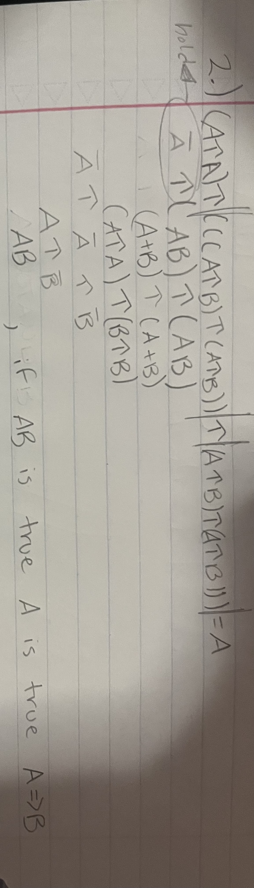
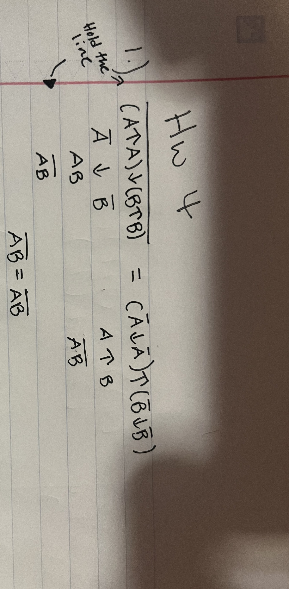
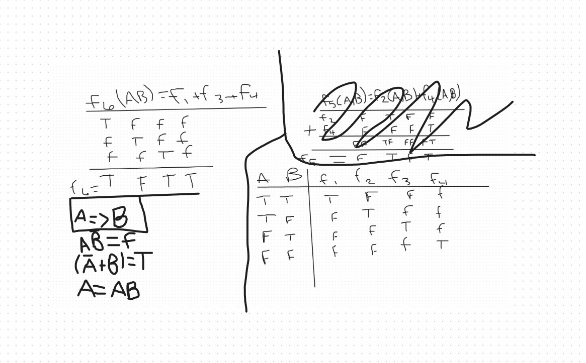

1.  Name the four major definitions of Probability (corresponding to the four major schools of thought in probability theory).  
Classical Probability, Bayesian Probability, Frequentist Probability, Propensity  

2.  Which school(s) of probability theory define(s) probability as degree of confidence?  
Frequentist Probability, Propensity  

3. Which school(s) of probability theory allow incorporation of expert (prior) knowledge in scientific inference?  
Classical Probability, Bayesian Probability  

4.  When data is scarce, which school of probability theory is the most useful for scientific inference?  
Classical Probability, Bayesian Probability  

5.  Name a prominent figure (person) in each of the Frequentist and Bayesian schools of thought.  
Frequentist - Ronald Fisher  
Bayesian - Edwin Jaynes  

6.  What is the range of a probability value? Is this range a convention or a necessity of the definition of probability?  
[0,1] or [1, + infinity]  and it must be in this range to be considered probability so it is a necessity for this type of philosophy.  

7.  Recall our class discussion on Probability Theory. Suppose you ask two equally-trustworthy people to look out the window and tell you what they see in the distance. They both observe an animal in the distance but their observation is different. One sees a horse and the other sees donkey. Which one of the observations would you trust? Why? Which principle of Probability Theory applies to this experiment and how?  

8.   
 .    

9.   
 .  

10.  
 .   
  

